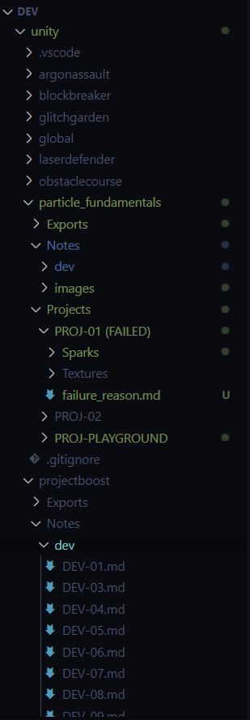

# Notes Manager (External)

## What is this?

    This is an application to help me manage my Game Development notes in these directories:

    unity
    blender
    photoshop

    Having well managed notes is important form me so succeed in my journey to become a well rounded game developer

## What does it do?

    In context of this application, unity and blender are known as platforms. 
    Creating projects within those creates whats called an epic.
    Wanting to do something within an epic such as creating new files or managing readmes (for note taking) is called a task. 
    Doing something within a task like deleting, adding is called an action. 
    This is to save me from making errors and to save me time in creating and managing projects.

## How to use?

    It can be used to deal with additional platforms but one step at a time.
    Make sure the repo is cloned in the same base directory as unity and blender

    Add this alias to you bash profile, assuming that unity, blender and external are all sitting in a repo called dev:
    alias app='cd ~/dev/external && npm run dev && cd -'
    
    In your terminal source the bash profile / bash rc file
    cd ~ && source .bashrc && cd -

    Then call "app" in your Terminal